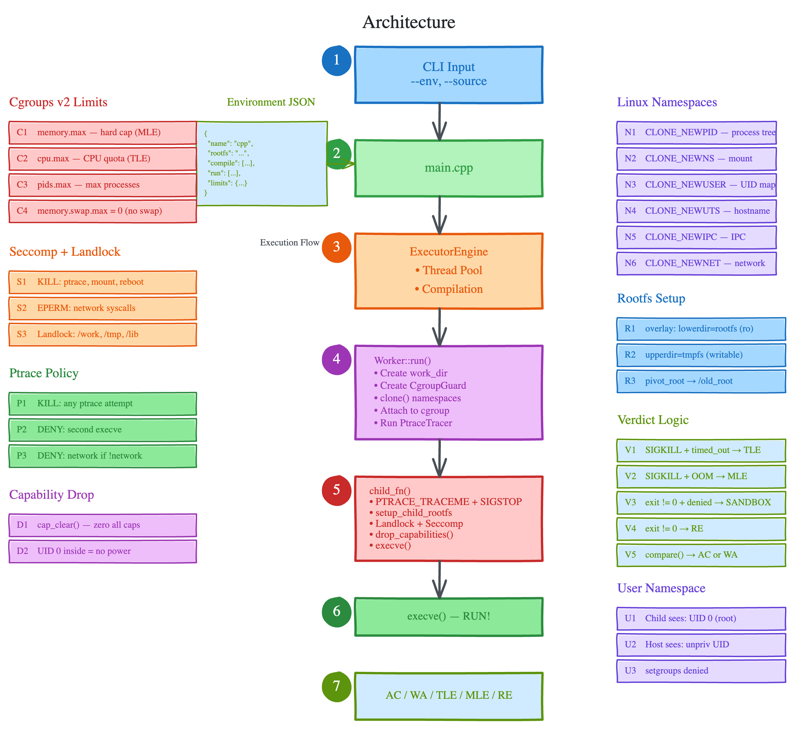
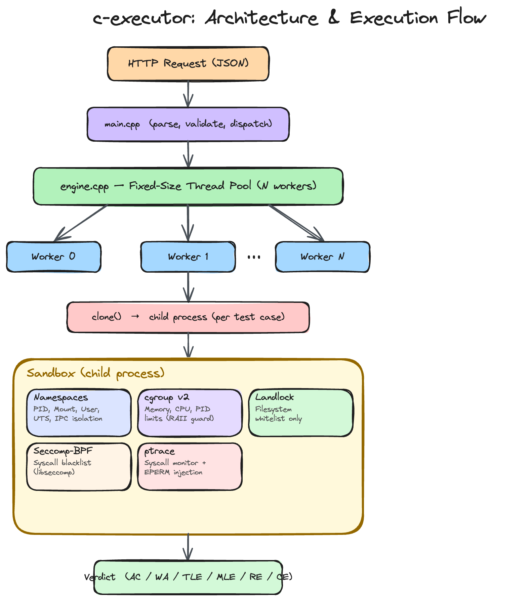

# cpp-executor

Runs untrusted code in isolated environments on Linux. No Docker.

---

## Why

This project is built for online judges, agent sandboxes, and batch code
execution where Docker is often heavier than needed.

1. **Higher throughput.** It is multithreaded, so one process can run many jobs
   in parallel.

2. **Faster compile and run.** Code runs inside a prepared sandbox environment.
   You avoid most of the startup cost of launching fresh containers.

3. **Safe for untrusted code.** It still uses namespaces, seccomp, Landlock,
   ptrace, and cgroup limits for CPU, memory, wall time, and process count.

4. **Better for judge workflows.** It is built around compile/run commands,
   stdin/stdout testing, limits, and verdicts like AC, WA, TLE, and RE.

5. **Easy environment setup.** Runtimes are described with JSON files and
   rootfs paths.

6. **Reuse existing dependencies.** If Python, ML, or Node packages already
   exist on the machine, the executor can mount them read-only and use them
   directly.

7. **No new Docker image every time.** If you need a new runtime or package set,
   you can usually update the JSON and mounted paths instead of building and
   pushing another image.

8. **Simpler GPU use.** GPU environments can expose CUDA and NVIDIA device paths
   and still keep the same runtime, memory, and verdict reporting flow.

9. **Good for repeated workloads.** If you run many submissions, testcases, or
   agent tasks, reusing prepared environments is usually simpler and faster.

---

## How it works

Each environment is a pre-built root filesystem on disk and a JSON config. No daemon, no image registry.

When code runs, it clones a process into isolated Linux namespaces, mounts an overlay over the rootfs, applies Landlock and seccomp filters, traces every syscall via ptrace, and enforces memory/CPU/PID limits with cgroup v2. The rootfs is read-only and shared. The writable layer is a tmpfs that disappears on exit.

Adding a new environment is one JSON file and one rootfs directory. No code changes.

---

## Architecture and flow

The diagrams below use a fixed height so they stay readable and consistent in the README.

### Architecture

<p align="center">
  
</p>

### Execution flow

<p align="center">
  
</p>

### YouTube explanation

[Watch the architecture and flow walkthrough](https://youtu.be/Y9qiC241oqI)

---

## Setup

```bash
apt install libseccomp-dev libcap-dev nlohmann-json3-dev

mkdir build && cd build
cmake .. && make -j$(nproc)
cd ..

# Create the cgroup root after the build and before running `./c-executor`.
# It is not reliably auto-created because `/sys/fs/cgroup` often needs root
# or delegated cgroup permissions.
mkdir -p /sys/fs/cgroup/executor
mkdir -p /tmp/executor/sandboxes

# If `/sys/fs/cgroup/executor` is not writable in your session, use a
# delegated per-user cgroup path instead:
# export EXECUTOR_CGROUP_ROOT="/sys/fs/cgroup$(cut -d: -f3 /proc/self/cgroup)/executor"
# mkdir -p "$EXECUTOR_CGROUP_ROOT"
```

---

## Usage

```bash
export EXECUTOR_CGROUP_ROOT="/sys/fs/cgroup/user.slice/user-$(id -u).slice/user@$(id -u).service/executor"
mkdir -p "$EXECUTOR_CGROUP_ROOT"
export EXECUTOR_DISABLE_ROOTFS=1

./c-executor/build/c-executor \
  --env cpp \
  --source ./test/cpp/main.cpp \
  --input ./test/cpp/input.txt \
  --output ./test/cpp/output.txt \
  --env-dir ./c-executor/environments \
  --threads 1

./c-executor/build/c-executor \
  --env python-ml \
  --source ./test/pytorch/main.py \
  --input ./test/pytorch/input.txt \
  --output ./test/pytorch/output.txt \
  --env-dir ./c-executor/environments \
  --threads 1
```

Why these exports are needed on some machines:

- `EXECUTOR_CGROUP_ROOT` is used because `/sys/fs/cgroup/executor` is often not
  writable as a normal user.
- `EXECUTOR_DISABLE_ROOTFS=1` is used because some machines do not allow the
  unprivileged mount/overlay/pivot_root sequence required for rootfs isolation.
  In that case the executor uses the host-filesystem fallback for testing.

`input.txt` and `expected.txt` are now treated as one combined batch. This is
meant for Codeforces-style input where the submitted program reads `t` from the
first line and handles the internal testcases itself.

There are no offset flags anymore.

```
Test 0: AC | 26ms | 476KB
```

Exit code 0 if all pass, 1 otherwise.

If a batch run fails, the diff tries to report the internal testcase:

```
Test 0: WA | 27ms | 476KB
  diff: case 3, line 1: got "4" expected "5"
```

For more setup and testing details, see `../test/commands.md`.

---

## Adding an environment

```json
{
  "name": "python-ml",
  "rootfs": "/opt/executor/rootfs/python-ml",
  "compile": null,
  "run": ["/usr/bin/python3", "{source}"],
  "extension": ".py",
  "limits": { "memory_mb": 2048, "cpu_time_ms": 30000, "wall_time_ms": 60000, "max_pids": 32 },
  "network": false,
  "gpu": true
}
```

Build the rootfs once, point the JSON at it, done.

```bash
debootstrap --variant=minbase bookworm /opt/executor/rootfs/python-ml
chroot /opt/executor/rootfs/python-ml pip3 install torch numpy
```

### Python packages with `uv` or `venv`

For local testing, you do not need to bake every Python package into the
rootfs. You can create a virtual environment on the host, install what you
need there, and mount it read-only into the sandbox.

From the repository root:

```bash
cd ./test

# Use either uv or the standard library venv module.
uv venv ./venvs/python-ml
# python3 -m venv ./venvs/python-ml

# Activation is optional, but convenient while installing packages.
source ./venvs/python-ml/bin/activate
pip install torch numpy pandas
deactivate
```

Then point the environment JSON at that mounted virtual environment:

```json
{
  "name": "python-ml",
  "rootfs": "../../test/rootfs/python-ml",
  "compile": null,
  "run": ["/test/venvs/python-ml/bin/python", "{source}"],
  "extension": ".py",
  "limits": {
    "memory_mb": 2048,
    "cpu_time_ms": 30000,
    "wall_time_ms": 60000,
    "max_pids": 32
  },
  "read_only_mounts": [
    {
      "source": "../../test/venvs/python-ml",
      "target": "/test/venvs/python-ml"
    }
  ],
  "network": false,
  "gpu": true
}
```

The important part is:

- install packages into one host-side venv
- mount that venv read-only with `read_only_mounts`
- use the mounted Python binary in `run`

### Node.js packages

For Node.js, create a host-side package directory, install packages there, and
mount the dependency files into the sandbox.

From the repository root:

```bash
cd ./test
mkdir -p ./node-envs/node-fullstack
cd ./node-envs/node-fullstack

npm init -y
npm install express axios zod
```

Then mount `node_modules` into `/work/node_modules`. If your code also depends
on runtime package metadata, mount `package.json` too.

```json
{
  "name": "node-fullstack",
  "rootfs": "../../test/rootfs/node-fullstack",
  "compile": null,
  "run": ["/usr/bin/node", "{source}"],
  "extension": ".js",
  "limits": {
    "memory_mb": 512,
    "cpu_time_ms": 15000,
    "wall_time_ms": 30000,
    "max_pids": 32
  },
  "read_only_mounts": [
    {
      "source": "../../test/node-envs/node-fullstack/node_modules",
      "target": "/work/node_modules"
    },
    {
      "source": "../../test/node-envs/node-fullstack/package.json",
      "target": "/work/package.json"
    }
  ],
  "network": false,
  "gpu": false
}
```

This lets you keep language packages outside the base rootfs while still making
them available inside the sandbox in a read-only way.

---

## Requirements

Linux 5.13+, cgroup v2, x86_64.
